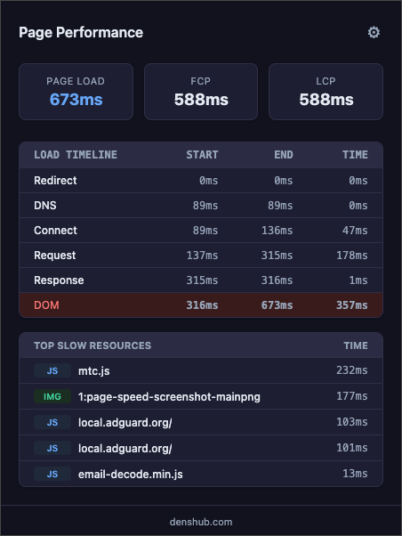
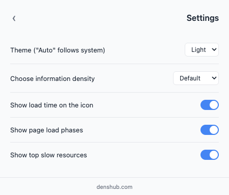

# Page Load Timer

A lightweight Chrome extension that measures and displays page load performance metrics for the active tab. Zero dependencies, Manifest V3, under 15 KB total.

| Light | Dark | Settings |
|:-----:|:----:|:--------:|
|  |  |  |

## Features

- **Core Metrics** — Page Load time, First Contentful Paint (FCP), and Largest Contentful Paint (LCP)
- **Load Timeline** — Phase-by-phase breakdown: Redirect, DNS, Connect, Request, Response, DOM processing
- **Slow Resources** — Top 10 slowest resources with type badges (JS, CSS, IMG, XHR, FONT, OTHER)
- **Badge Indicator** — Color-coded load time on the extension icon (green ≤1s, orange ≤3s, red >3s)
- **Themes** — Auto (follows OS), Light, and Dark
- **Density** — Roomy, Default, and Compact layouts
- **Settings Persistence** — All preferences saved in `chrome.storage.local`

## Installation

### Chrome Web Store

<!-- TODO: uncomment once published
[](https://chromewebstore.google.com/detail/PAGE_ID)
-->

*Coming soon* — the extension is pending review.

### From source (developer mode)

1. Clone this repository:
   ```bash
   git clone https://github.com/denis-rasulev/page-speed.git
   ```
2. Open `chrome://extensions` in Chrome
3. Enable **Developer mode** (top-right toggle)
4. Click **Load unpacked**
5. Select the cloned project folder

## Usage

1. Navigate to any website
2. Click the extension icon to view performance metrics
3. Use the ⚙ button to customize theme, density, and visible sections

If metrics show `--`, reload the page and reopen the popup.

## How It Works

```
Page Load → content.js collects timing + vitals → background.js stores per-tab →
popup.js renders on click
```

| File | Role |
|------|------|
| `manifest.json` | Extension config (Manifest V3) |
| `shared.js` | Shared utilities — resource formatting, grouping, navigation timing |
| `content.js` | Content script — captures FCP/LCP via PerformanceObserver, collects navigation + resource timing on page load |
| `collect.js` | On-demand collector — injected by background script for already-loaded tabs |
| `background.js` | Service worker — per-tab data storage, badge updates, message routing |
| `popup.html` | Popup UI markup and styles |
| `popup.js` | Popup logic — settings management, safe DOM rendering of metrics |

## Project Structure

```
page-speed/
├── icons/                 # Extension icons (16, 32, 48, 128, 512px)
├── screenshots/           # README screenshots
├── manifest.json          # Extension config (Manifest V3)
├── shared.js              # Shared utilities
├── content.js             # Content script (auto-collects on page load)
├── collect.js             # On-demand collector (injected for pre-loaded tabs)
├── background.js          # Service worker
├── popup.html             # Popup UI and styles
├── popup.js               # Popup logic
└── LICENSE
```

> `icons/icon512.png` is not referenced in the manifest — it's required for the [Chrome Web Store listing](https://developer.chrome.com/docs/webstore/images#icons).

## Permissions

| Permission | Why |
|------------|-----|
| `activeTab` | Access performance data from the current tab |
| `storage` | Persist settings and per-tab metrics |
| `scripting` | Inject on-demand collector into already-loaded pages |
| `tabs` | Read tab ID to associate metrics with the correct tab |

## Contributing

Contributions are welcome. Please open an issue first to discuss what you'd like to change.

1. Fork the repository
2. Create your feature branch (`git checkout -b feature/my-feature`)
3. Commit your changes
4. Push to the branch (`git push origin feature/my-feature`)
5. Open a Pull Request

## License

This project is licensed under the [MIT License](LICENSE).

Extension icon by [Appzgear](https://www.iconpacks.net/free-icon/speed-button-thunderbolt-1214.html) (Clear Icons), licensed under [CC BY 4.0](https://creativecommons.org/licenses/by/4.0/).
