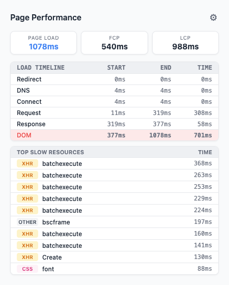

# Page Load Timer (Chrome Extension)

A lightweight Chrome extension that measures page load performance for the active tab.

## Screenshot

## What it shows
- Page Load, FCP, and LCP times
- Load timeline phases (Redirect, DNS, Connect, Request, Response, DOM)
- Top slow resources (JS, CSS, images, fonts, XHR, other)
- Badge color by load speed (green, orange, red)

## Settings (v1.1)
- Toggle badge text on the extension icon
- Choose theme: `auto`, `light`, or `dark`
- Choose information density: `roomy`, `default`, or `compact`
- Show/hide the load timeline section
- Show/hide the slow resources section
- Settings are persisted in `chrome.storage.local`

## Install (local)
1. Open `chrome://extensions`
2. Enable **Developer mode**
3. Click **Load unpacked**
4. Select this project folder

## Usage
1. Open a website
2. Reload the page
3. Click the extension icon to view metrics
4. Use the settings button in the popup to customize what is shown

If data is not visible yet, reload once and open the popup again.

## Project files
- `manifest.json`: extension config (MV3), current version `1.1`
- `shared.js`: shared resource formatting/grouping helpers used across scripts
- `content.js`: collects navigation timing, resources, and web vitals from the page
- `collect.js`: on-demand page metrics collector injected by the background script
- `background.js`: stores per-tab data, triggers on-demand collection, and updates badge state
- `popup.html` + `popup.js`: popup UI, settings view, and safe rendering of timeline/resources
